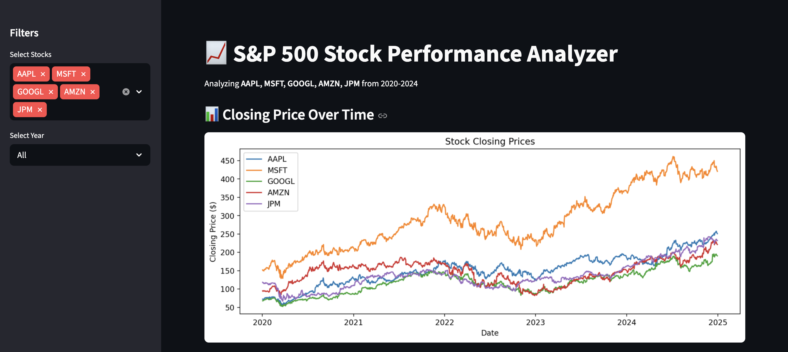

# 📈 S&P 500 Stock Performance Analyzer

A data engineering project that pulls real stock market data, stores it in a SQL database, and visualizes insights through an interactive dashboard.

## 🔍 Overview

This project analyzes the performance of 5 major S&P 500 stocks (AAPL, MSFT, GOOGL, AMZN, JPM) from 2020-2024 using Python, SQL, and Streamlit.

## 📸 Dashboard Preview


## 🛠️ Tech Stack

- **Python** — data collection and analysis
- **yfinance** — real-time stock data API
- **SQLite + SQLAlchemy** — local SQL database
- **Pandas** — data manipulation and cleaning
- **Matplotlib** — data visualization
- **Streamlit** — interactive dashboard

## 📊 Features

- Pulls historical stock data via API
- Cleans and stores data in a structured SQL database
- Advanced SQL queries using window functions (LAG) and CTEs
- Interactive dashboard with filters by stock and year
- Visualizations including price trends, volatility, and year over year performance

## 🚀 How to Run

**1. Clone the repo:**
```bash
git clone https://github.com/Rusheekb/sp500-analyzer.git
cd sp500-analyzer
```

**2. Install dependencies:**
```bash
pip install -r requirements.txt
```

**3. Fetch the data:**
```bash
python3 src/fetch_data.py
```

**4. Load into database:**
```bash
python3 src/database.py
```

**5. Launch the dashboard:**
```bash
streamlit run src/dashboard.py
```

## 📁 Project Structure
sp500-analyzer/
│
├── data/               # Raw CSV data (gitignored)
├── src/
│   ├── fetch_data.py   # Pulls stock data from yfinance API
│   ├── database.py     # Loads data into SQLite and runs queries
│   ├── analyze.py      # Advanced SQL analysis
│   └── dashboard.py    # Streamlit interactive dashboard
├── requirements.txt
└── README.md

## 💡 Key SQL Concepts Used

- Window functions (LAG, PARTITION BY)
- CTEs (Common Table Expressions)
- Aggregations and GROUP BY
- Date filtering with STRFTIME

## 👤 Author

Built by [Rusheek Bajjuri] — [www.linkedin.com/in/rusheek-bajjuri]
